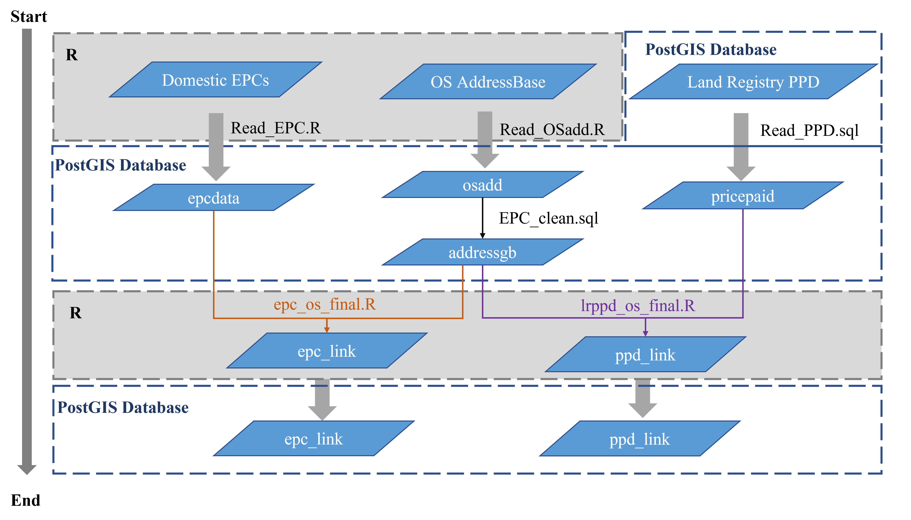
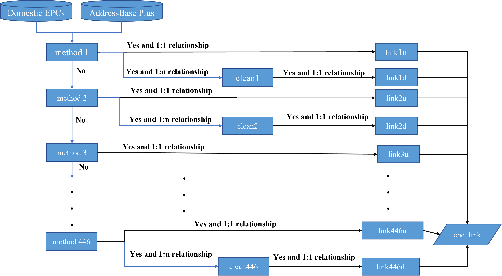
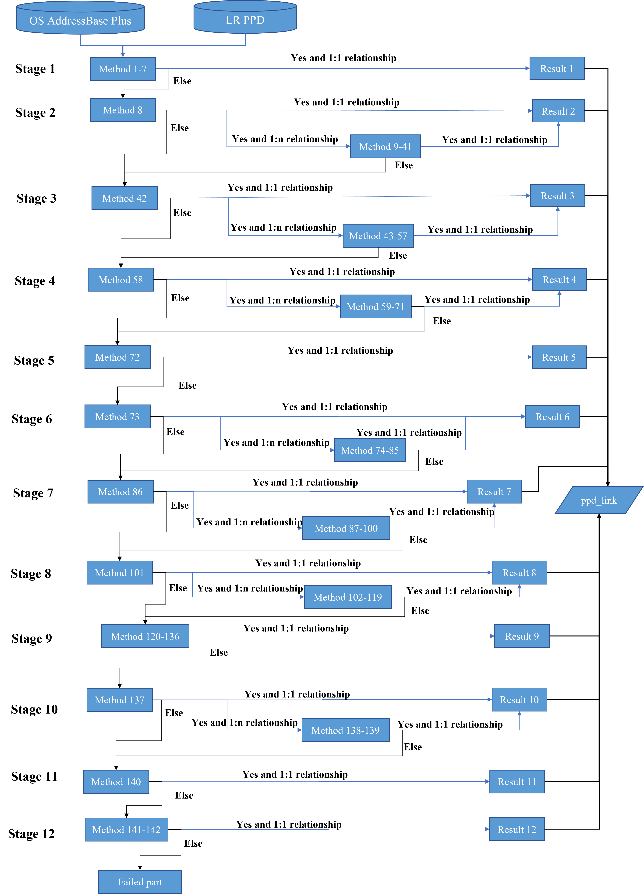

# Linking Domestic Energy Performance Certificates (EPCs) and and Land Registry Price Paid Data (PPD) with UPRN


This repository contains the code for OS short term project. This reserach aims to explore how easy it is to attribute UPRNs to address information, looking at two property datasets in England and Wales, one is Domestic EPCs and the other is Land Registry PPD. This project is licensed under the terms of the [Creative Commons Attribution-NonCommercial (CC-BY-NC)](https://creativecommons.org/licenses/by-nc/4.0/). This whole research is **not** allowed to be used  **commercially**. 


## Repository contents
* [EPC/](EPC/): R files for conducting the address matching bewtween Domestic EPCs and OS AddressBase Plus dataset
* [PPD/](PPD/): R code for conducting the address matching bewtween Land Registry PPD and OS AddressBase Plus dataset
* [pic/](pic/): Additional figures for the readme file in this repositry.

* [EPC_clean.sql](EPC_clean.sql): SQL code for cleaning the EPC data before address matching
* [README.md](README.md): A description of the whole data linkage work.
* [Read_EPC.R](Read_EPC.R): R code for fast reading multiple EPC csv files together and then saveing to PostGIS database
* [Read_OSadd.R](Read_OSadd.R): R code for reading OS AddressBase Plus data and then saveing to PostGIS database
* [Read_PPD.sql](Read_PPD.sql): SQL code for reading the whole Land Registry PPD in PostGIS database
* [lookup_1.csv](lookup_1.csv): Additional csv files for conducting the address matching work


## 1. Set up

The whole rearach are mainly conducted in R, with data inputs and outputs stored in a PostGIS database. Figure 1 displays the whole workflow.



**Figure 1.**  The overall workflow of this project

### 1.1 Create a new spatial database in PostgreSQL
This research created a new PostGIS database and named it as **os_ubdc** (https://postgis.net/workshops/postgis-intro/creating_db.html). Here, the password of postgres is assumed to be **654321**.
### 1.2 Set up the working directory for R
The process for setting the working directory is listed below:
- Create a directory named "OS_Data" on your D: drive.
- Create a sub-directory named "e90_ab_plus_csv_gb" in "OS_Data" folder.This e90_ab_plus_csv_gb folder stores OS AdddressBase Plus (AB_Plus_Data.csv).
- Create a sub-directory named "EPC" in "OS_Data" folder. This EPC folder stores whole list of Domestic EPC dataset.
- Create a sub-directory named "PPD" in "OS_Data" folder. This PPD folder stores Land Registry PPD(pp-complete.csv).
### 1.3 Read data in PostGIS database
Three datasets are need to read in PostGIS before conduct the data linakge work.This is achieve by running [Read_EPC.R](Read_EPC.R),[Read_OSadd.R](Read_OSadd.R) and [Read_PPD.sql](Read_PPD.sql).

For OS AddressBase Plus data in the PostGIS database, we further removed the uprn record which is the also a parentuprn in AddressBase dataset.

## 2. Run Data linkage process
The main data linkage process is conducted in R. Below we sepeate introduce the data linkage work.
### 2.1 Attaching UPRN in Domestic EPCs
The tagging UPRN work for Domestic EPCs contains 446 detailed match rules.336 of the 446 match rules are conducted at the postcode level, the remaining 109 match rules are conducted at postcode sector level or even higher. The whole linkage workflow is shown in Figure 2. The code for this linakge process is in [EPC/](EPC/).



**Figure 2.** A Brief workflow of data linkage between Domestic EPCs and OS AddressBase Plus

As shown in Figure 2, part of the matching rule(e.g. method 1) has a customized cleaning method(e.g clean 1). Each linkage method and the cleaning method has commented like the below two examples.

* *Example of two matching rules (methods 1 and 2) in the R code:* *


***NOTE:*** Each matching rule in the R code share the same coding structure, thus we only comments the first matching rule. The difference between two matching rule are the function part.
```
####################method 1 ####################
#create the funciton for matching rule 1
function1<- function(x,y){
  x<-x[x$saotext=="",]
  x<-x[x$subbuildingname=="",]
  x<-x[x$paotext=="",]
  x<-x[x$saostartnumber=="",]
  x<-x[x$saostartsuffix=="",]
  x<-x[x$saoendnumber=="",]
  x<-x[x$saoendsuffix=="",]
  x<-x[x$paostartsuffix=="",]
  x<-x[x$paoendnumber=="",]
  x<-x[x$paoendsuffix=="",]
  x<-x[x$buildingname=="",]
  x<-x[x$subbuildingname=="",]
  #combine buildingnumber and streetdescription with a comma into bnstreet field
  x$bnstreet <- paste(x$buildingnumber,x$streetdescription,sep=",")
  #remove the blank space in bnstreet
  x$bnstreet <- gsub(" ", "", x$bnstreet)
  x$addressf <- paste(x$postcodelocator,x$bnstreet,sep=",")
  
  #remove the blank space in add
  y$addressfinal <- trimws(y$add)
  y$addressfinal <- gsub(" ", "", y$addressfinal)
  y$addressf <- paste(y$postcode,y$addressfinal,sep=",")
  #match on addressf field
  taba1 <- inner_join(x,y,by="addressf")
 
  return(taba1)
}
#run the matching rule 1 function
link1<-function1(add,epc)
#subset the linked dataset
needlist1<-c("lmk_key","postcode.y","property_type","uprn","add1","add2","add3","add","postcode.x","postcodelocator","buildingname","buildingnumber","subbuildingname","paostartnumber","paostartsuffix","paoendnumber","paoendsuffix","paotext","saostartnumber","saostartsuffix","saoendnumber","saoendsuffix","saotext","streetdescription","locality","dependentlocality","townname","class","lodgement_date","inspection_date","lodgement_datetime")
link1<-link1[,..needlist1]
#get the one to one linkage result
link1u<- uniqueresult(link1)
#get the one to many linkage result
link1d <- doubleresult(link1)
#remove the linked records from the original EPC dataset
epc <- matchleft(epc,link1)
#remove the link1 to save memory
rm(link1)
####################method 2####################
function2<- function(x,y){
  x<-x[x$saotext=="",]
  x<-x[x$subbuildingname=="",]
  x$bnstreet <- paste(x$buildingnumber,x$streetdescription,sep=",")
  x$bnstreet <- gsub(" ", "", x$bnstreet)
  x$addressf <-paste(x$postcodelocator,x$bnstreet,sep=",")
  
  y$addressfinal <- trimws(y$add)
  y$addressfinal <- gsub(" ", "", y$addressfinal)
  y$addressf <- paste(y$postcode,y$addressfinal,sep=",")
  taba1 <- inner_join(x,y,by="addressf")

  return(taba1)
}
link2<-function2(add,epc)
link2<-link2[,..needlist1]

link2u<- uniqueresult(link2)
link2d <- doubleresult(link2)

epc <- matchleft(epc,link2)

rm(link2)
```
Example of one cleaning rules (clean 1) in the R code:

```
####################clean 1 keep the residential UPRN####################
#select the residential uprn from the mutiple linked UPRN
linkd_1<-linkd[linkd$method=="link1d" & substr(linkd$class,1,1)=="R",]
#remove the linkd_1 from linkd
linkd<-matchleft(linkd,linkd_1)
```
### 2.2 Attaching UPRN in Land Registry PPD
The address matching work for Land Registry PPD is easier than Domestic EPCs. It contains 12 linkage stages with 142 match rules.Within each stage, a series of match rules are were conduct in order. For each matching rule, we only keep the one-to-one linkage result in the linked data. Figure 3 displays the whole linakge workflow between Land Registry PPD and OS AddressBase Plus.The code for this linakge process is in [PPD/](PPD/)



**Figure 3.** A Brief workflow of data linkage between Land Registry PPD and OS AddressBase Plus

In the R code, each match rule is commanded with the linkage method. An example of the first match rule is shown below: 
```
############method 1 SAON is equal to pp ############m
#create the full address for address matching      
trannull$addressf <-paste(trannull$postcode,trannull$saon,sep=",")
addnull$addressf <- paste(addnull$postcodelocator,addnull$pp,sep=",")

#match the two datasets by the common field
null1<- inner_join(trannull,addnull,by="addressf")

#keep transactionid and uprn field in the linked data
needlist1<-c("transactionid","uprn")
null1<-null1[,..needlist1]
#create a new field to record the linkage method
null1$method<-"method1"
#extract the one to one linkage result
null1u<-uniqueresult(null1)


```
## 3. Acknowledgements
This work was funded by OS.